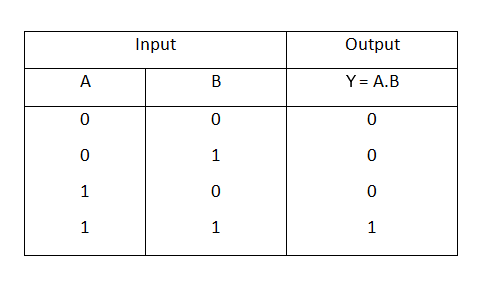
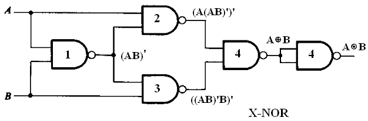
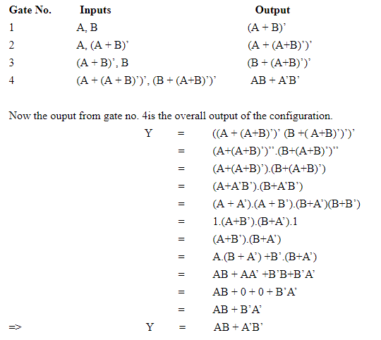
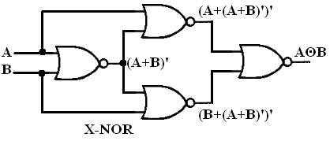

### Introduction
Logic gates are electronic circuits which perform logical functions on one or more inputs to produce one output. There are seven logic gates. When all the input combinations of a logic gate are written in a series and their corrresponding outputs written along them, then this input/ output combination is called Truth Table.  

                  
### 1)Nand gate as Universal gate
 
NAND gate is actually a combination of two logic gates i.e. AND gate followed by NOT gate. So its output is complement of the output of an AND gate.This gate can have minimum two inputs. By using only NAND gates, we can realize all logic functions: AND, OR, NOT, Ex-OR, Ex-NOR, NOR. So this gate is also called as universal gate.
                    

#### 1.1)NAND gates as OR gate
From DeMorgan’s theorems:  (A.B)’ = A’ + B’ (A’.B’)’ = A’’ + B’’ = A + B
 So, give the inverted inputs to a NAND gate, obtain OR operation at output. 

  <b>Figure-1:NAND gates as OR gate</b>
 

  <b>Figure-2:Truth table of OR</b>
 

#### 1.2)NAND gates as AND gate

A NAND produces complement of AND gate. So, if the output of a NAND gate is inverted, overall output will be that of an AND gate. 
<b>Y = ((A.B)’)’</b> <b>Y = (A.B)</b>
 

  <b>Figure-3:NAND gates as AND gate</b>
 

  <b>Figure-4:Truth table of AND</b>
 

#### 1.3)NAND gates as Ex-OR gate
The output of a two input Ex-OR gate is shown by: Y = A’B + AB’. This can be achieved with the logic diagram shown in the left side. 

  <b>Figure-5:NAND gate as Ex-OR gate</b>
 

  <b>Figure-6:Truth table of Ex-OR</b>
 

#### 1.4)NAND gates as Ex-NOR gate
Ex-NOR gate is actually Ex-OR gate followed by NOT gate. So give the output of Ex-OR gate to a NOT gate, overall output is  that of an Ex-NOR gate. 
<b> Y = AB+ A’B’</b>

 

  <b>Figure-7:NAND gates as Ex-NOR gate</b>
 

  <b>Figure-8:Truth table of Ex-NOR</b>
 

</b>
 
      
  
 

#### 1.5) Implementing the simplified function with NAND gates only
We can now start constructing the circuit. First note that the entire expression is inverted and we have three terms ANDed. This means that we must use a 3-input NAND gate. Each of the three terms is, itself, a NAND expression. Finally, negated single terms can be generates with a 2-input NAND gate acting as an inverted. Figure 8 illustrates a circuit using NAND gates only. 
 
<b>F=((C'.B.A)'(D'.C.A)'(C.B'.A)')' </b> 
  

   <b>Figure-9:Implementing the simplified function with NAND gates only</b>
 

</b>
 
      
### 2)Nor gate as Universal Gate

NOR gate is actually a combination of two logic gates: OR gate followed by NOT gate. So its output is complement of the output of an OR gate.This gate can have minimum two inputs, output is always one. By using only NOR gates, we can realize all logic functions: AND, OR, NOT, Ex-OR, Ex-NOR, NAND. So this gate is also called universal gate.
 

#### 2.1)NOR gates as OR gate
A NOR produces complement of OR gate. So, if the output of a NOR gate is inverted, overall output will be that of an OR gate. 
<b>Y = ((A+B)’)’  Y = (A+B)</b>  

 <b> Figure-10:NOR gates as OR gate</b> 

  <b>Figure-11:Truth table of OR</b> 

#### 2.2)NOR gates as AND gate
From DeMorgan’s theorems:  (A+B)’ = A’B’ (A’+B’)’ = A’’B’’ = AB So, give the inverted inputs to a NOR gate, obtain AND operation at output. 

  <b>Figure-12:NOR gates as AND gate</b> 

  <b>Figure-13:Truth table of AND</b> 

#### 2.4)NOR gates as Ex-OR gate
Ex-OR gate is actually Ex-NOR gate followed by NOT gate. So give the output of Ex-NOR gate to a NOT gate, overall output is that of an Ex-OR gate. Y = A’B+ AB’
 

  <b>Figure-14:NOR gates as Ex-OR gate</b>
 

  <b>Figure-15:Truth table of Ex-OR</b>
 

#### 2.3)NOR gates as Ex-NOR gate
The output of a two input Ex-NOR gate is shown by: Y = AB + A’B’. This can be achieved with the logic diagram shown in the left side. 

 

   <b>Figure-16:NOR gates as Ex-NOR gate </b>
 

 <b>Figure-17:Truth table of Ex-NOR </b>
  

#### 2.5)Constructing a circuit with NOR gates only
Designing a circuit with NOR gates only uses the same basic techniques as designing a circuit with NAND gates; that is, the application of deMorgan’s theorem. The only difference between NOR gate design and NAND gate design is that the former must eliminate product terms and the later must eliminate sum terms. <b>F=(((C.B'.A)+(D.C'.A)+(C.B'.A))')'  </b>
 

  
 <b>Figure-18:Implementing the simplified function with NOR gates only</b>
  

